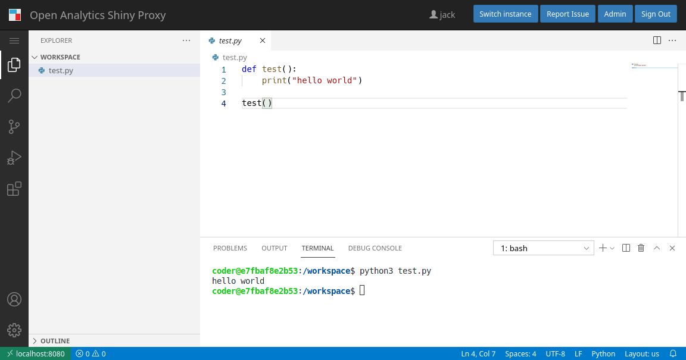
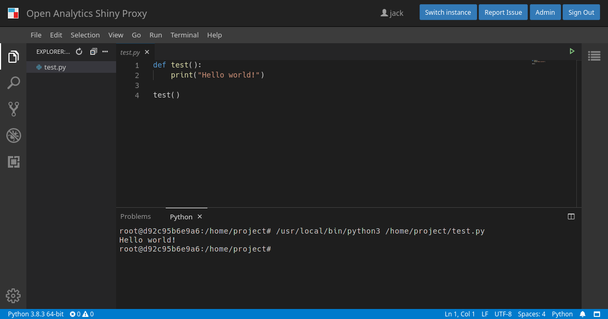

# Running VS Code And Eclipse Theia inside ShinyProxy

[Screenshots](#screenshots)

This repository explains how to run VS Code and Eclipse Theia as a native webapp
in ShinyProxy. This example works in ShinyProxy 2.5.0 or later.

## Building the Docker image

### VS Code

The VS Code project does not provide official Docker images for running VS Code
as a webapp. Fortunately, the [Code Server](https://github.com/cdr/code-server)
project provides ready to use Docker images. Note that the VS Code provided in
these images are not using the official builds of Microsoft, therefore they do
not use the same Marketplace as the VS Code which you can download from the Microsoft
site, [see their FAQ](https://github.com/cdr/code-server/blob/main/docs/FAQ.md#why-cant-code-server-use-microsofts-extension-marketplace).

You can pull the Docker image using:

```bash
sudo docker pull codercom/code-server:latest
```

### Eclipse Theia

The Theia project provides a number of different Docker images, providing out of
the box support for different programming environments. As an example you can
pull the Docker image containing the Python toolchain:

```bash
sudo docker pull theiaide/theia-python:latest
```

### Installing Extensions

You can customize the VS Code image so it contains some extensions by default:

```Dockerfile
FROM codercom/code-server:latest

RUN code-server --install-extension ikuyadeu.r-pack
```

## ShinyProxy Configuration

Create a ShinyProxy configuration file (see [application.yml](application.yml)
for a complete file), containing:

```yaml
proxy:
  specs:
    - id: vscode
      container-image: codercom/code-server:latest
      port: 8080
      container-cmd: ["/usr/bin/entrypoint.sh", "--bind-addr", "0.0.0.0:8080", "--auth=none", "--disable-update-check", "--disable-telemetry", "."]
      websocket-reconnection-mode: None
    - id: theia-python
      container-image: theiaide/theia-python:latest
      port: 3000
      websocket-reconnection-mode: None
```

Both projects require minimal configuration in ShinyProxy to work. An
improvement on this setup could be to mount a persistent workspace for the user:

```yaml
proxy:
  specs:
    - id: vscode
      container-image: codercom/code-server:latest
      port: 8080
      container-cmd: ["/usr/bin/entrypoint.sh", "--bind-addr", "0.0.0.0:8080", "--auth=none", "--disable-update-check", "--disable-telemetry", "/workspace"]
      container-volumes: [ "/tmp/vscode/#{proxy.userId}/work:/workspace"]
      websocket-reconnection-mode: None
    - id: theia-python
      container-image: theiaide/theia-python:latest
      container-volumes: [ "/tmp/theia/#{proxy.userId}/work:/home/project"]
      container-env:
      port: 3000
      websocket-reconnection-mode: None
```

**Note**: by default the processes in the VS Code image run under a non-root
user. Depending on the configuration of the volume, this user may not have write
access in the workspace directory. A user can use the following command to fix
this:

```bash
sudo chown -R coder:coder /workspace
```

In order to automate this, you can modify the `/usr/bin/entrypoint.sh` of the
Docker image.

## Screenshots



<br>



**(c) Copyright Open Analytics NV, 2021.**
